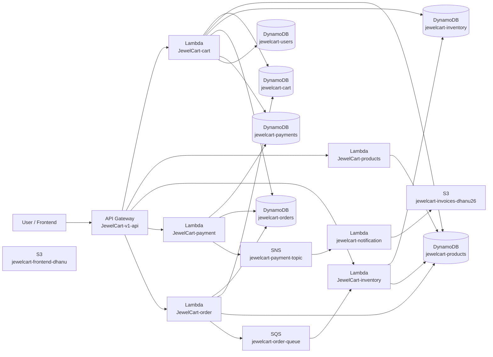

# E-commerce Terraform Project

This folder contains a beginner-friendly Terraform Infrastructure as Code (IaC) project for the **E-commerce** application. The AWS resource names stay exactly as they already exist in AWS, so you can learn Terraform while managing real infrastructure instead of toy examples.

## What Terraform Is

Terraform is a tool that lets us describe cloud infrastructure in code. Instead of manually clicking through the AWS console, we write `.tf` files that explain what resources should exist and how they should be configured.

## Why Infrastructure as Code Is Useful

- It makes infrastructure repeatable.
- It documents your cloud setup in a readable way.
- It reduces manual mistakes.
- It makes reviewing infrastructure changes easier.
- It helps teams understand how services connect.

## Important Note About This Project

The AWS resources in this project already exist. That means the normal real-world workflow is:

1. Write the Terraform configuration.
2. Run `terraform init`.
3. Run `terraform plan` to check the configuration.
4. Import the existing AWS resources into Terraform state.
5. Run `terraform plan` again to verify Terraform matches reality.

Example import commands you will likely use:

```bash
terraform import module.cart_lambda.aws_lambda_function.this JewelCart-cart
terraform import module.products_lambda.aws_lambda_function.this JewelCart-products
terraform import module.inventory_lambda.aws_lambda_function.this JewelCart-inventory
terraform import module.payment_lambda.aws_lambda_function.this JewelCart-payment
terraform import module.order_lambda.aws_lambda_function.this JewelCart-order
terraform import module.notification_lambda.aws_lambda_function.this jewelcart-notification
```

You would do the same idea for API Gateway, DynamoDB, S3, SQS, SNS, and IAM resources. Importing is what allows Terraform to start managing resources that are already in your AWS account.

## Project Architecture

This project manages:

- 6 Lambda functions
- 1 API Gateway REST API
- 6 DynamoDB tables
- 1 SQS queue
- 1 SNS topic
- 2 S3 buckets
- 1 IAM role for Lambda

## Folder Structure

```text
terraform/
├── provider.tf
├── versions.tf
├── variables.tf
├── terraform.tfvars.example
├── outputs.tf
├── main.tf
├── README.md
└── modules/
    ├── lambda/
    ├── dynamodb/
    ├── api_gateway/
    ├── s3/
    ├── sqs/
    ├── sns/
    └── iam/
```

## Terraform Workflow

### `terraform init`

Initializes the working directory. Terraform downloads the AWS provider and prepares the project.

### `terraform fmt`

Formats Terraform files so they are neat and consistent. This is the easiest way to keep `.tf` files readable.

### `terraform validate`

Checks whether the Terraform configuration is syntactically valid. It helps catch mistakes before planning or applying.

### `terraform plan`

Shows what Terraform wants to create, update, or delete. Think of this as a preview before making any real change.

### `terraform apply`

Executes the plan and makes the infrastructure changes in AWS.

### `terraform destroy`

Deletes the resources managed by Terraform. Be very careful with this command in real AWS environments, especially when working with existing resources.

## How The AWS Services Work Together

- API Gateway receives HTTP requests and forwards them to the cart, products, inventory, payment, and order Lambda functions.
- The REST paths follow the current application routes such as `/cart`, `/products`, `/inventory`, `/orders`, and `/payments`.
- The Lambda functions contain the business logic for each microservice.
- DynamoDB stores service data such as carts, products, inventory, orders, payments, and users.
- The order service sends a message to SQS when an order event should be processed asynchronously.
- The inventory service consumes messages from SQS so stock processing is decoupled from the API request.
- The payment service publishes payment events to SNS.
- The notification Lambda subscribes to the SNS topic and creates invoice files in S3.
- The notification Lambda is intentionally event-driven, so it is not exposed as a public API route.
- The frontend bucket can host static frontend assets, while the invoices bucket stores generated invoice files.
- IAM gives the Lambda functions permission to talk to the AWS services they need.

## Mermaid Architecture Diagram



## Beginner Tips

- Start with `terraform validate` and `terraform plan` before `terraform apply`.
- Read the comments in every file. They explain why each resource exists.
- Import existing resources before trying to apply changes to them.
- Keep the AWS resource names unchanged so Terraform matches the real environment.
